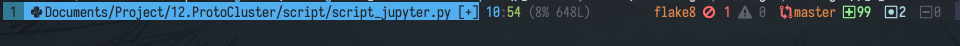
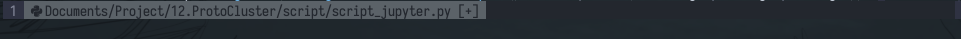

Statusline
==========
This statusline is from [phaazon's repo](https://github.com/phaazon/config/blob/master/nvim-lua/statusline.vim).

ScreenShot
==========

Requirement
===========
- [tpope/vim-fugitive](https://github.com/tpope/vim-fugitive): for git branch
- [lewis6991/gitsigns.nvim](https://github.com/lewis6991/gitsigns.nvim): for git hunk status
- [airblade/vim-gitgutter](https://github.com/airblade/vim-gitgutter): for git hunk status
- [dense-analysis/ale](https://github.com/dense-analysis/ale): for linting status
- [ryanoasis/vim-devicons](https://github.com/ryanoasis/vim-devicons): for fancy icons
